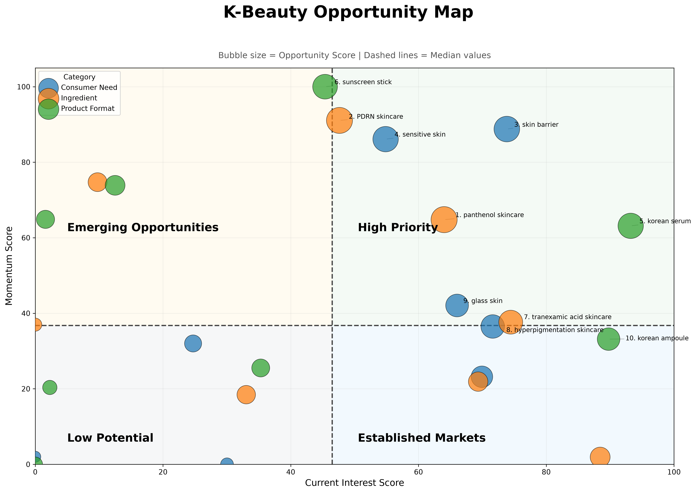
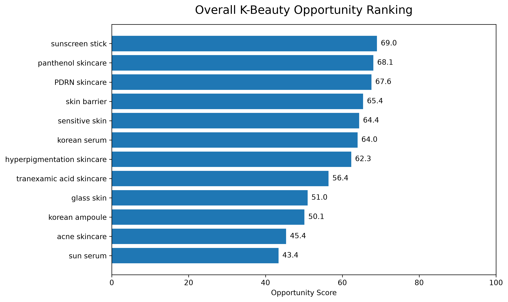
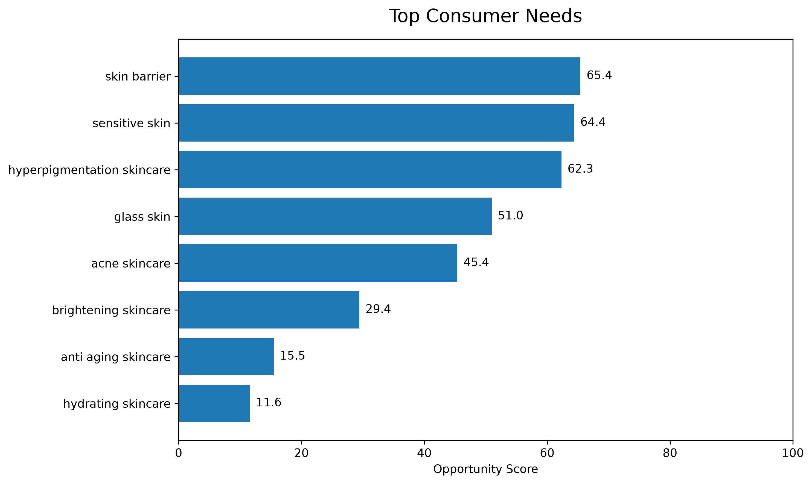
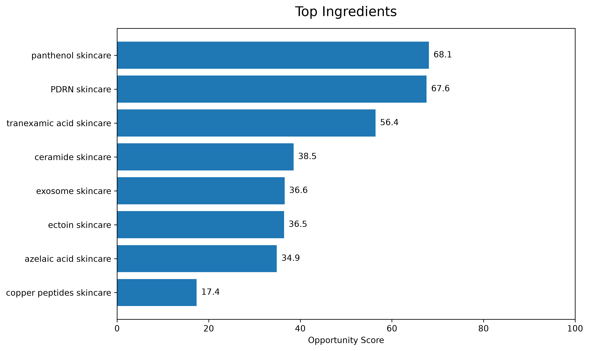
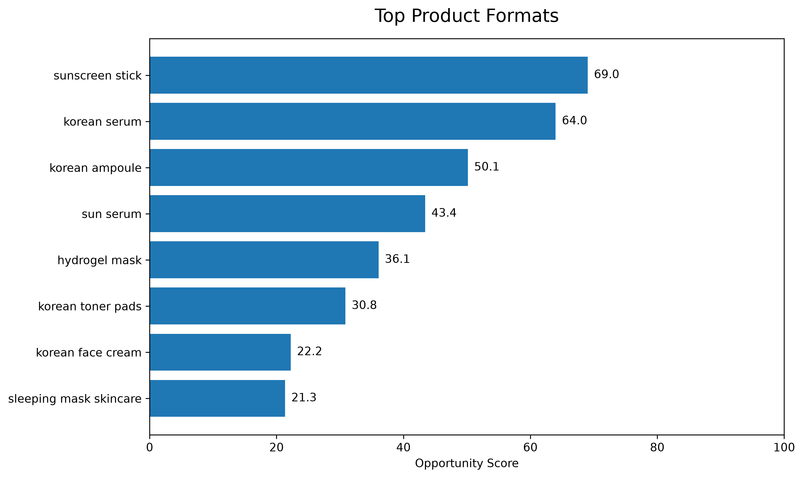

# K-Beauty Product Opportunity Radar

> Identifying emerging K-beauty product opportunities using consumer search behavior and creator attention.



---

## Project Overview

Beauty brands constantly ask:

> **What product should we launch next?**

This project combines multiple public data sources to identify emerging skincare opportunities using an Opportunity Score based on consumer demand and growth momentum.

Instead of measuring popularity alone, the model highlights trends with both high current interest and strong future potential.

---

## Business Objective

Build a decision-support tool that helps marketing and product teams identify promising opportunities before markets become saturated.

---

## Data Sources

- Naver DataLab
- Google Trends
- YouTube Data API

---

## Analysis Pipeline

```
Data Collection
      ↓
Data Cleaning
      ↓
Feature Engineering
      ↓
Opportunity Score
      ↓
Visualization
      ↓
Business Recommendations
```

---

## Features

The Opportunity Score combines:

- Current Interest
- Momentum
- Creator Attention
- Data Coverage

---

## Visualizations

### Opportunity Map


---

### Overall Opportunity Ranking



---

### Consumer Needs



---

### Ingredients



---

### Product Formats



---

## Example Findings

Top Consumer Needs

- Skin Barrier
- Sensitive Skin
- Hyperpigmentation

Top Ingredients

- Panthenol
- PDRN
- Tranexamic Acid

Top Product Formats

- Korean Serum
- Sunscreen Stick
- Korean Ampoule

---

## Repository Structure

```
.
├── data
│   ├── raw
│   └── processed
│
├── outputs
│   ├── opportunity_map.png
│   ├── overall_ranking.png
│   ├── consumer_need.png
│   ├── ingredient.png
│   └── product_format.png
│
├── src
│   ├── collectors
│   └── analysis
│
├── README.md
└── requirements.txt
```

---

## Skills Demonstrated

- Python
- Data Collection
- REST APIs
- Data Cleaning
- Feature Engineering
- Data Visualization
- Marketing Analytics
- Consumer Insights
- Business Strategy

---

## Future Improvements

- TikTok trend analysis
- Amazon review mining
- Olive Young product rankings
- Brand-level competitive analysis
- Sales forecasting

---

## Author

Dash Khankhuslen

Data Science | Marketing Analytics | Consumer Insights